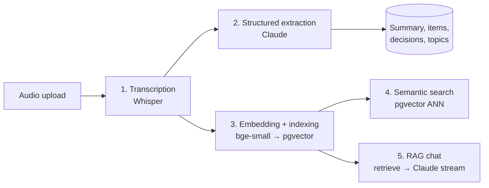
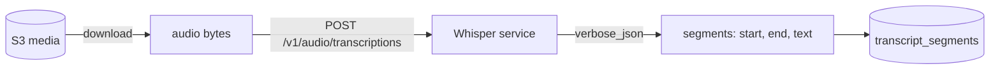
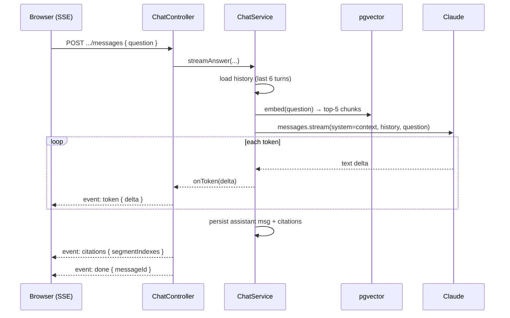

# AI Workflows

| Field     | Value                              |
|-----------|------------------------------------|
| Version   | 1.0                                |
| Status    | Phase 10 — Draft, pending approval |
| Date      | 2026-07-23                         |
| Depends on| architecture.md, tech-stack.md     |
| Phase     | 10 of 18 — AI Integration          |

This document explains **every AI workflow** in the system: what it does, the prompt/model
strategy, *why* we chose it, alternatives, and the cost/latency trade-offs. The implementation
lives across `infrastructure/ai/*` and `modules/processing` + `modules/chat` + `modules/search`.

> **Provider-agnostic by design.** Every capability (STT, LLM, embeddings) sits behind a token
> (`STT_PROVIDER`, `LLM_PROVIDER`, `EMBEDDING_PROVIDER`). Swapping a provider is a one-line
> module rebinding — none of the workflows below import a vendor SDK directly.

---

## 0. The five workflows



Workflows 1–3 run **once per meeting** in the worker pipeline. Workflows 4–5 run **per request**
in the API.

---

## 1. Transcription (Speech-to-Text)

**What:** Convert the uploaded audio into timestamped, speaker-labeled segments.

**Flow:**


**Strategy**
- Self-hosted Whisper behind an OpenAI-compatible HTTP endpoint, returning `verbose_json`
  (per-segment timestamps).
- Speaker label is `"Speaker 1"` in v1 (no diarization).

**Why this / alternatives / cost**
- *Why self-host:* no per-minute cost, no lock-in, full control. *Trade-off:* we run + tune it.
- *Alternative:* managed STT (Deepgram, AssemblyAI, OpenAI Whisper API) — faster to ship, better
  out-of-box diarization, but recurring per-minute cost. One provider swap away.
- *Cost:* CPU-bound; GPU optional at our volumes. The biggest latency in the pipeline.
- *Upgrade path:* swap in a diarization-capable backend and populate real speaker labels.

---

## 2. Structured Extraction (LLM)

**What:** From the transcript, produce a summary, key points, action items, decisions, and topics.

**Strategy — prompt engineering**
- A single Claude call with a strict **JSON output contract** (see `SYSTEM_PROMPT`).
- Rules baked into the prompt: be faithful (no invention), derive `assigneeText` from phrasing
  like "X will/needs to", empty arrays when absent, concise fields (<~25 words).
- We parse defensively: extract the first `{…}` object and tolerate surrounding prose/fences.

**Why this / alternatives / cost**
- *Why one call:* cheaper and lower-latency than four separate prompts; the model reasons about
  the whole meeting at once.
- *Alternative for guaranteed structure:* **tool use / structured outputs** — define a tool whose
  args are the schema, forcing valid JSON. We start with JSON-instructed prompting (simpler) and
  upgrade to tool use if parsing proves flaky. The parsing layer is already defensive either way.
- *Alternative for quality:* two-pass (extract → self-review). Adds latency/cost; defer until needed.
- *Cost:* one call/meeting, `max_tokens` 2048 — the dominant per-meeting LLM cost.
- *Guardrail:* on parse failure we **fail soft** (empty insights) rather than lose the transcript.

---

## 3. Embedding + Indexing

**What:** Turn the transcript into searchable vectors.

**Flow:**
```mermaid
flowchart LR
  Segs[transcript segments] -->|chunk ~230 words| Chunks[chunk drafts]
  Chunks -->|batch embed| Emb[bge-small]
  Emb -->|vector(384)| DB[(embedding_chunks<br/>+ HNSW index)]
```

**Strategy**
- Chunk segments into ~230-word windows (≈300 tokens), each recording its source segment range.
- Embed the batch in one call with the self-hosted model (`BAAI/bge-small-en-v1.5`, 384 dims).
- Store via raw SQL (`$executeRaw` + `::vector`) because Prisma can't write the `vector` type.
- HNSW index (from `docs/database.md` §6) gives approximate-nearest-neighbor search.

**Why this / alternatives / cost**
- *Why 384-dim self-hosted:* no per-call cost, fine accuracy for meeting-scale corpora, small
  storage. *Alternative:* OpenAI `text-embedding-3-small` (1536-dim, better recall, per-call cost).
- *Why chunk, not whole transcript:* retrieval must return coherent passages, and chunks keep each
  query's context small (cost + grounding).
- *Cost:* one embed call/meeting. Re-embedding only if the model changes (versioned).
- *Dimension migration:* changing the model = new column dimension + backfill (see database.md §9).

---

## 4. Semantic Search

**What:** "Find meetings where we discussed X" — by meaning, not just keywords.

**Flow:**
```mermaid
flowchart LR
  Q[query] -->|embed| Qv[query vector]
  Qv -->|ORDER BY embedding <=> q| ANN[pgvector ANN<br/>workspace-scoped]
  ANN --> Dedupe[dedupe by meeting]
  Dedupe --> Results[ranked SearchResult[]]
```

**Strategy — hybrid**
- **Semantic:** embed the query, run `ORDER BY embedding <=> $query` over chunks joined to meetings
  (filtered by `workspace_id`), keep the best chunk per meeting, score = `1 - cosine_distance`.
- **Keyword:** ILIKE over `transcript_segments.text`.
- **Hybrid (default):** union both, keep the max score per meeting, sort, cap at 20.

**Why this / alternatives / cost**
- *Why hybrid:* pure-vector misses exact terms (product names, acronyms); pure-keyword misses
  meaning. Merging wins.
- *Alternative ranking:* reciprocal-rank fusion (RRF) instead of max-score merge — better
  theoretically; our max-score merge is simpler and good enough at this scale.
- *Cost:* one embed call + one indexed ANN query per search. The HNSW index keeps it sub-linear.

---

## 5. RAG Chat (Retrieval-Augmented Generation)

**What:** "Ask this meeting a question" → a grounded, cited, streaming answer.

**Flow:**


**Strategy — prompt engineering + grounding**
- **Retrieval:** top-5 chunks for *this* meeting via cosine search.
- **Grounding prompt:** "Answer using ONLY the excerpts. If not present, say you couldn't find it."
  Context excerpts go in the **system** message.
- **Conversation memory:** the last ~6 turns are passed as `messages` history so follow-ups
  ("and who owes that?") have context. Windowed to bound token cost.
- **Citations are server-side:** derived from the retrieved chunks' segment ranges — *never* from
  the model. This guarantees citations are real and clickable into the transcript.
- **Streaming:** Anthropic `messages.stream`, deltas emitted as SSE `token` events for low
  perceived latency.

**Why this / alternatives / cost**
- *Why RAG, not stuff-the-whole-transcript:* long transcripts blow the context window and cost;
  retrieval keeps each turn small and *grounded*.
- *Why server-side citations:* models hallucinate citations; retrieval can't. Trustworthy by design.
- *Why windowed memory:* full history grows unbounded tokens; 6 turns is a good recall/cost balance.
- *Alternative (roadmap):* "ask across all meetings" mode — widen the retrieval filter beyond one
  meeting and group answers by source.
- *Cost:* one embed + one streaming call per turn.

---

## 6. Cross-cutting: cost & latency strategy

| Lever | How we apply it |
|-------|-----------------|
| **Caching** | Embeddings/summaries computed once per meeting (not per read). Hot reads cached in Redis (Phase 13). |
| **Model tiering** | Cheaper model for extraction/chat; reserve larger models for hard tasks if needed. |
| **Streaming** | Chat streams tokens → low time-to-first-token. |
| **Bounded context** | Chunks (~300 tokens) + 6-turn history keep every call small. |
| **Batching** | Embed a meeting's chunks in one call; batch searches by workspace. |
| **Quotas** | Plan limits cap STT/LLM spend (Phase 9 usage service). |

## 7. Failures & safety

- **Unfaithful output:** grounding prompts + (extraction) fail-soft parsing + (chat) "couldn't find it".
- **Provider outage:** BullMQ retries with backoff; the meeting is marked `FAILED`, not silently stuck.
- **PII in transcripts:** content is tenant-isolated; never sent to a provider outside the configured
  model (Phase 12 covers data-handling policy in depth).
- **Cost runaway:** per-plan quotas + async (non-request-path) processing.

---

*End of Phase 10 deliverable. Approval required before Phase 11 (Testing).*
