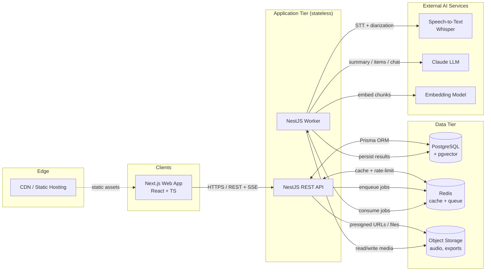
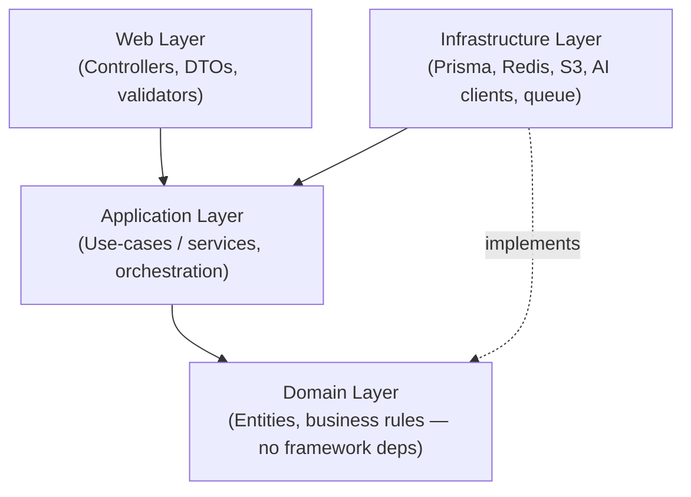
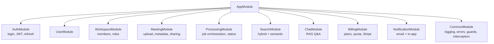
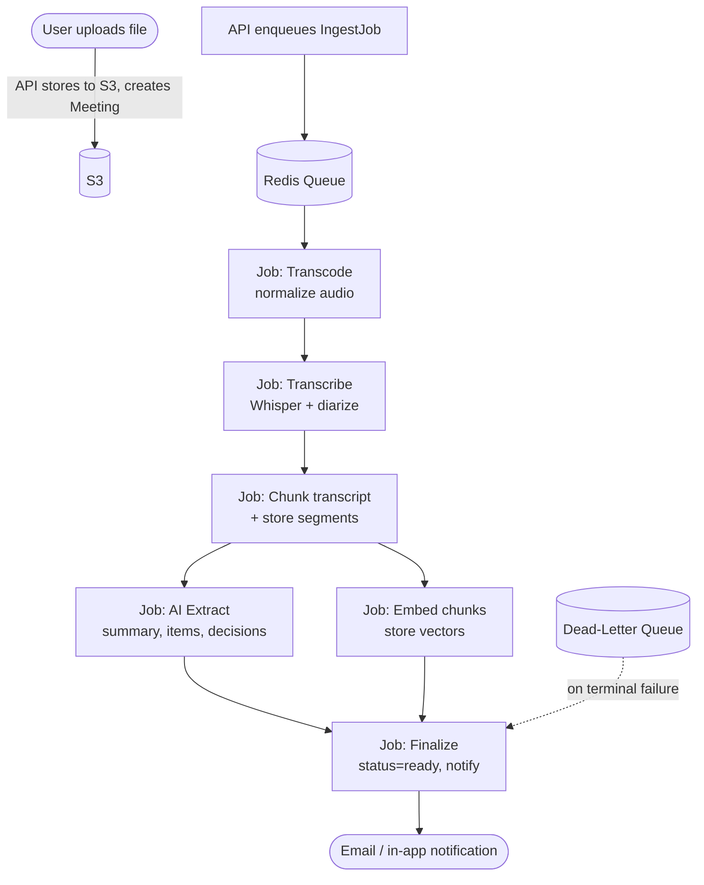
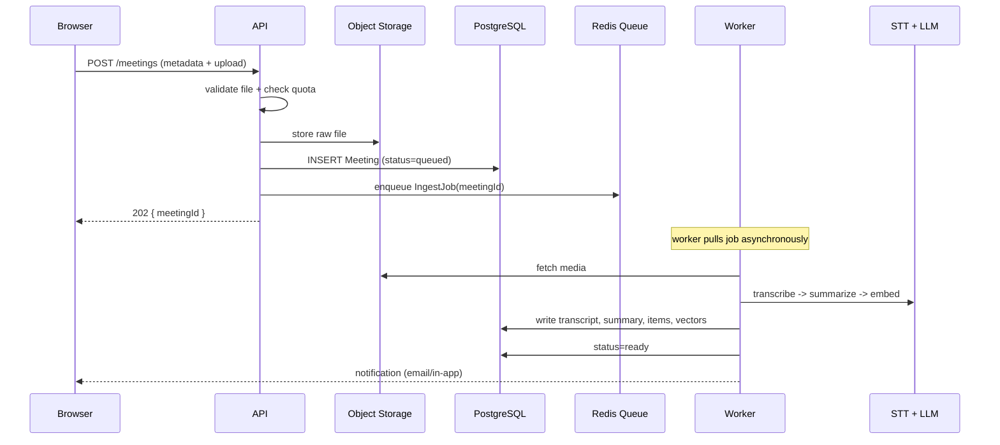
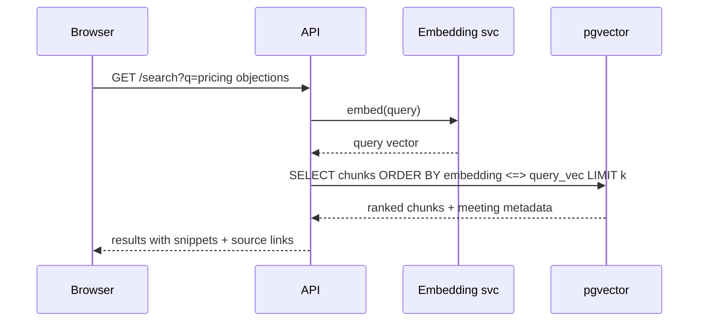
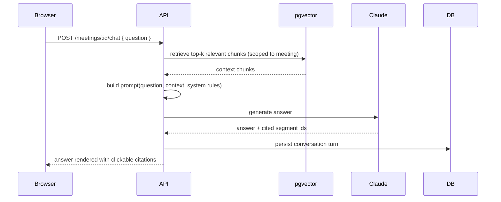
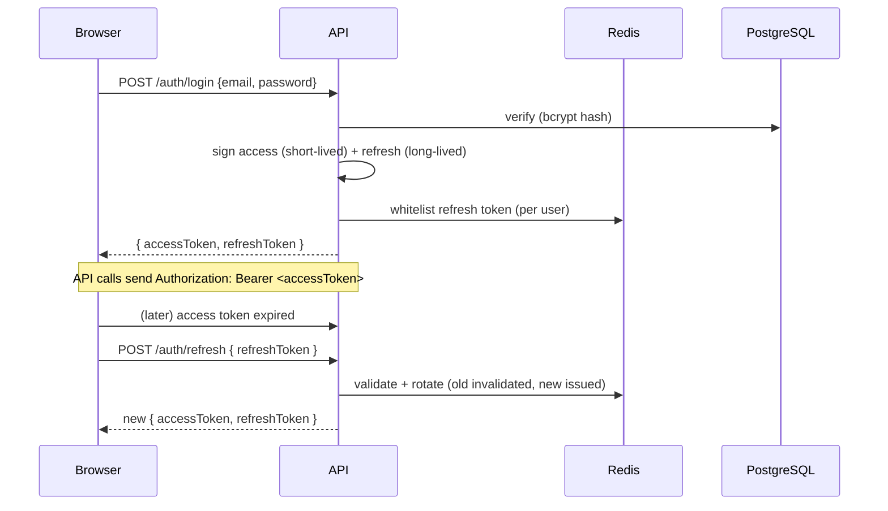
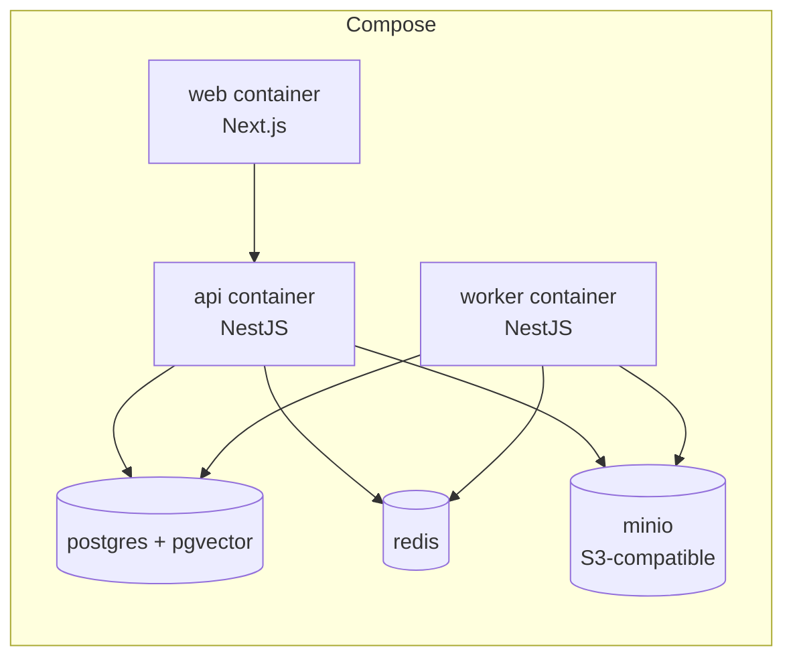

# System Architecture
## AI Meeting Assistant

| Field     | Value                              |
|-----------|------------------------------------|
| Version   | 1.0                                |
| Status    | Phase 2 — Draft, pending approval  |
| Date      | 2026-07-21                         |
| Depends on| PRD.md v1.0                        |
| Phase     | 2 of 18 — System Design            |

---

## 1. Architectural Style & Driving Principles

We choose a **Modular Monolith with an asynchronous job pipeline**, deployed as **two processes** (API + Worker) sharing a codebase. This is the single most important decision in this document; everything below follows from it.

**Driving principles**
1. **Clean Architecture** — business logic is isolated from frameworks, databases, and transport. Dependencies point *inward* toward the domain.
2. **Modularity** — the codebase is split by *bounded context* (Auth, Meeting, Search, Chat, Billing…), each a NestJS module with a clear public interface. Modules can later be extracted into separate services with minimal friction.
3. **Async-first for slow work** — transcription and LLM calls take seconds to minutes. They **never** run in the request cycle. They go on a queue and are processed by workers.
4. **Statelessness where it matters** — the API holds no in-memory session state, so it scales horizontally by adding instances.
5. **12-Factor App** — config in environment variables, logs to stdout, backing services treated as attached resources, disposability.
6. **Pit of success for tenants** — multi-tenant isolation is enforced by convention *and* code (every query is workspace-scoped), not left to memory.

> **Why not microservices for v1?** Microservices buy you independent scaling and deployment boundaries — at the cost of distributed transactions, network-failure modes, service discovery, and a heavy ops surface. At our scale (and as a learning project), that cost has no payoff. A modular monolith gives us 90% of the benefits (clean boundaries, separately-scalable workers) at 20% of the complexity, and *preserves the option* to split later. This is the path most successful startups actually take (e.g., Shopify, Basecamp, GitHub's early years).

---

## 2. High-Level Architecture (HLD)

### Component responsibilities

| Component | Responsibility | Why it exists separately |
|-----------|----------------|--------------------------|
| **Next.js Web App** | UI: upload, transcript view, search, chat, billing. | Separates presentation from logic; can be deployed to a CDN edge. |
| **NestJS API** | AuthN/Z, request validation, CRUD, quota enforcement, job enqueue, search/chat orchestration. | The only public entry point; stays thin and fast. |
| **NestJS Worker** | Consumes queue jobs: transcode → transcribe → AI → embed. | Isolates slow, CPU/IO-heavy, retry-prone work from user-facing latency. Scales independently. |
| **PostgreSQL + pgvector** | Source of truth (users, workspaces, meetings, transcripts, usage) **and** vector store for semantic search. | Relational integrity + vector search in one transactional store = fewer moving parts. |
| **Redis** | BullMQ queue backend, cache, rate-limit counters, refresh-token whitelist. | Fast, versatile, single tool covers three needs. |
| **Object Storage (S3)** | Raw audio/video, transcoded audio, generated exports. | DBs are not file stores; blobs go to object storage. |
| **STT (Whisper)** | Audio → timestamped transcript + speaker turns. | Specialized model; swappable (self-hosted vs managed). |
| **Claude LLM** | Summary, action items, decisions, chat answers. | High-quality reasoning for structured extraction and Q&A. |
| **Embedding model** | Text → vectors for semantic search & RAG. | Required by search/chat; decoupled from the chat LLM so we can tune independently. |

---

## 3. Low-Level Architecture (Module & Layer View)

### 3.1 Clean Architecture layers (dependency direction is inward)

- **Domain** has zero knowledge of NestJS, Prisma, or any vendor. Pure TypeScript.
- **Application** orchestrates use-cases and depends only on *interfaces* defined in the domain (Dependency Inversion).
- **Infrastructure** implements those interfaces (repositories, AI clients). This is where Prisma/Redis/AWS live.
- **Web** translates HTTP ↔ application calls. Validation, auth guards, and serialization live here.

*Why this layering?* It makes the core business rules **testable without a database or HTTP**, and lets us swap Prisma for something else without touching the domain. The cost is more files and indirection — worth it for a system expected to evolve across 18 phases.

### 3.2 NestJS module map (bounded contexts)

Each module exposes a public interface and may only import other modules' public exports — never their internals. This is what keeps the monolith "modular" rather than a ball of mud.

### 3.3 The AI processing pipeline (the heart of the worker)

Each box is an **idempotent BullMQ job**; failure triggers retry-with-backoff, then a dead-letter queue. Status is written to PostgreSQL so the UI can show progress.

- **Chunking strategy:** transcript split into ~300-token overlapping windows so semantic search returns coherent passages.
- **Idempotency:** each job carries `meetingId` + step name; re-running a step replaces its prior output rather than duplicating.
- **Separability:** jobs are independent, so transcription and embedding can run on different worker pools later if needed.

---

## 4. Data Flow Diagrams

### 4.1 Upload & process (happy path)

### 4.2 Semantic search

### 4.3 Meeting chat (RAG — Retrieval-Augmented Generation)

> **Why RAG instead of "let the LLM read the whole transcript"?** Two reasons: (1) cost and token limits — long transcripts blow the context window; (2) *grounding* — by retrieving specific chunks and forcing citations, we drastically reduce hallucination and can show the user *where* the answer came from. This is the standard pattern for trustworthy Q&A over private documents.

### 4.4 Authentication (JWT access + rotating refresh)

---

## 5. Cross-Cutting Concerns

| Concern | Approach |
|---------|----------|
| **Authentication** | Email/password (bcrypt) + optional Google OAuth. JWT access tokens (short TTL) + refresh tokens (rotating, Redis-whitelisted). |
| **Authorization** | Role-based (Owner/Admin/Member) at workspace level, enforced by NestJS guards. Resource-level checks use a `WorkspaceGuard`. |
| **Multi-tenancy** | Every tenant-scoped table carries `workspace_id`; all queries are scoped via repository conventions + tests. *Decision: application-level isolation now, Postgres Row-Level-Security only if/when needed.* |
| **Caching** | Redis for hot reads (meeting lists, plan info), rate-limit counters, and refresh-token whitelist. HTTP cache headers on static/immutable assets. |
| **Rate limiting** | Sliding-window in Redis, per-user and per-IP tiers; tighter on auth + AI endpoints. |
| **Error handling** | Global exception filter → consistent JSON error envelope `{ error: { code, message, details? } }`. Never leak stack traces in prod. |
| **Validation** | Request DTOs validated at the controller boundary (class-validator). Reject early, reject loudly. |
| **Observability** | Structured JSON logs (pino), Prometheus metrics, health endpoints, Sentry for errors, OpenTelemetry tracing across API↔worker↔DB. |
| **Security** | TLS everywhere; AES-256 at rest; parametrized queries via Prisma (SQL-injection-safe by default); React's auto-escaping for XSS; file validation by magic-bytes; secrets in env/vault. (Full treatment in Phase 12.) |
| **Resilience** | Retries with exponential backoff + jitter on AI/STT calls; circuit breakers for external deps; idempotent jobs; dead-letter queue. |

> **On CSRF:** because the SPA sends credentials via `Authorization: Bearer` (not cookies), the classic CSRF vector largely doesn't apply. Where we do use cookies (e.g., refresh token in an httpOnly cookie), we add SameSite + double-submit tokens. We'll formalize this in Phase 12.

---

## 6. Deployment Topology

### 6.1 Development (Docker Compose — Phase 14)

### 6.2 Production target (Phase 16 — options preview)

- **Web** → Vercel / static hosting + CDN (edge delivery, zero-config scaling).
- **API + Worker** → container platform (AWS ECS/Fargate, Railway, or Render). Worker pool scales on queue depth.
- **Postgres** → managed (RDS / Neon / Render Postgres) with automated backups.
- **Redis** → managed (ElastiCache / Upstash).
- **Storage** → S3.
- *Full pros/cons and a recommendation come in Phase 16.*

---

## 7. Architecture Decision Records (ADRs)

Industry best practice: record *why*, not just *what*. ADRs are short, immutable, and append-only.

### ADR-001 — Modular monolith over microservices
- **Context:** Greenfield B2B SaaS, small team, learning project, 10k-user v1 scale.
- **Decision:** Modular monolith (NestJS modules) + async worker process.
- **Consequences:** Faster development, easier local dev, simpler ops. Boundaries must be disciplined or the monolith degrades.
- **Alternatives:** Microservices (rejected: ops overhead, distributed complexity); serverless functions (rejected: cold starts + awkward for long-running AI orchestration).

### ADR-002 — pgvector inside PostgreSQL over a dedicated vector DB
- **Context:** Need semantic search + RAG. Already running Postgres.
- **Decision:** Use the `pgvector` extension.
- **Consequences:** One fewer system to run; vector + relational writes share transactions; HNSW index handles our scale. At very large vector counts (>10M) a dedicated DB (Qdrant/Pinecone) would win.
- **Alternatives:** Qdrant, Pinecone, Weaviate (each = +1 ops surface, justified only at scale).

### ADR-003 — BullMQ + Redis for the job pipeline
- **Context:** Long, multi-stage, retry-prone AI jobs.
- **Decision:** BullMQ on Redis.
- **Consequences:** Job priorities, retries, rate-limited queues, dead-letter queues, dashboards. Redis already in the stack (caching/rate-limit), so no new dependency.
- **Alternatives:** RabbitMQ (heavier, richer routing than we need), SQS (cloud lock-in), Temporal (excellent for long workflows but steep learning curve — candidate for roadmap).

### ADR-004 — Separate Worker process from API
- **Context:** Transcription/LLM calls block for minutes.
- **Decision:** API only enqueues; a worker process executes jobs.
- **Consequences:** User requests never block on AI; workers scale independently by queue depth; a failing job can't crash the API.
- **Alternatives:** In-process background tasks (rejected: scale + reliability problems), per-job serverless functions (rejected: cold starts, state-sharing difficulty).

### ADR-005 — RAG over whole-transcript prompting for chat
- **Context:** Answer user questions from a meeting.
- **Decision:** Retrieve relevant chunks via pgvector, then prompt Claude with only those chunks + citation instructions.
- **Consequences:** Lower cost, lower hallucination, citable answers. Adds a retrieval step (negligible latency).
- **Alternatives:** Stuff whole transcript into the prompt (rejected: token limits, cost, weaker grounding).

---

## 8. Scalability & Reliability Summary

- **Horizontal scale:** stateless API behind a load balancer; worker pool auto-scales on queue depth.
- **Database:** start single Postgres; add read replicas and connection pooling (PgBouncer) as load grows; pgvector HNSW index for ANN search.
- **Blobs:** object storage is inherently elastic.
- **Backpressure:** queue concurrency caps + BullMQ rate limiting prevent worker stampedes and protect AI-provider rate limits.
- **Failure isolation:** a transcription outage degrades *new* meetings but the app (search, chat, sharing) keeps serving existing data.

---

## 9. Traceability to Requirements

| PRD area | Architecture element |
|----------|----------------------|
| FR-C Upload | API `MeetingModule` + S3 + `IngestJob` |
| FR-D Transcription | Worker + STT + transcript storage |
| FR-E AI processing | Worker pipeline jobs (J4) |
| FR-F Search | `SearchModule` + pgvector |
| FR-G Chat | `ChatModule` + RAG flow |
| FR-J Billing/quota | `BillingModule` + quota guard + Redis counters |
| NFR Performance | Async jobs, caching, indexes |
| NFR Security | Guards, isolation, validation, TLS |

---

## 10. Open Questions (before Phase 3)

1. **Vector store:** confirm pgvector (recommended) vs. a dedicated vector DB?
2. **STT deployment:** self-hosted Whisper (lower marginal cost, ops overhead) vs. managed STT API (higher cost, zero ops)? This directly affects Phase 3 + Docker.
3. **Deployment target preference:** any constraints pushing us toward a specific cloud (AWS vs. Railway/Render)? (Determines Phase 16 but informs Phase 3 choices.)

---

*End of Phase 2 deliverable. Approval required before Phase 3 (Technology Selection).*
