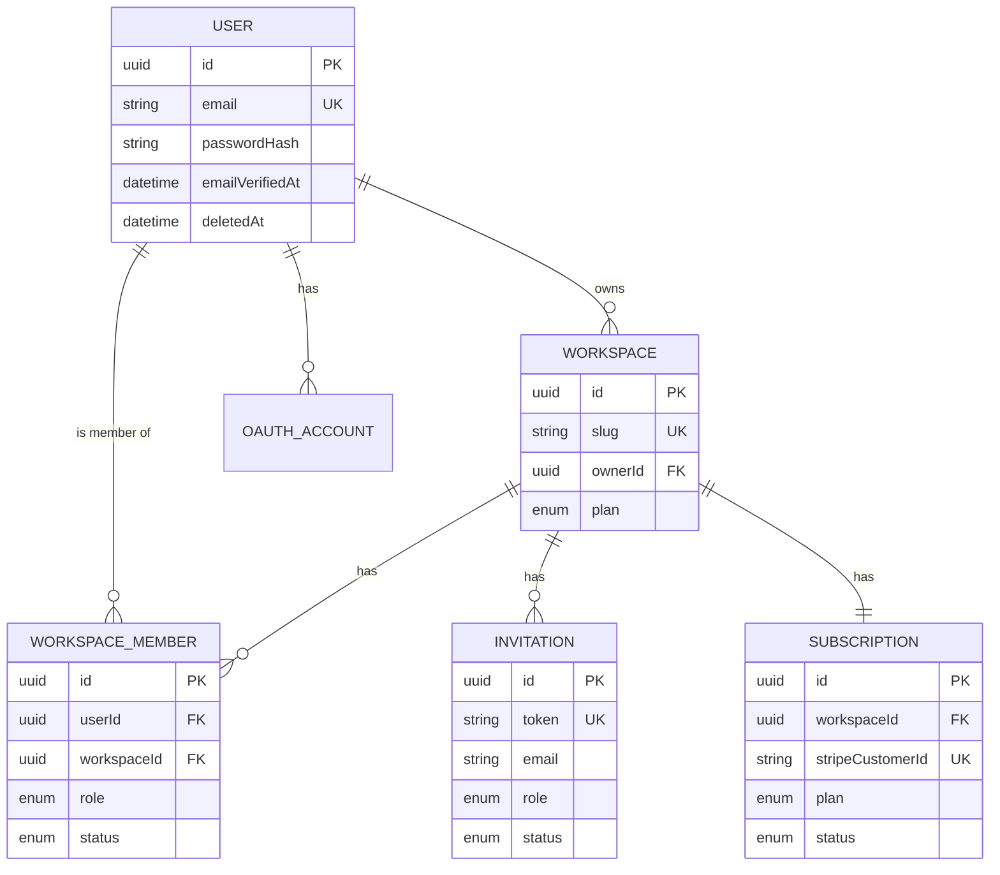
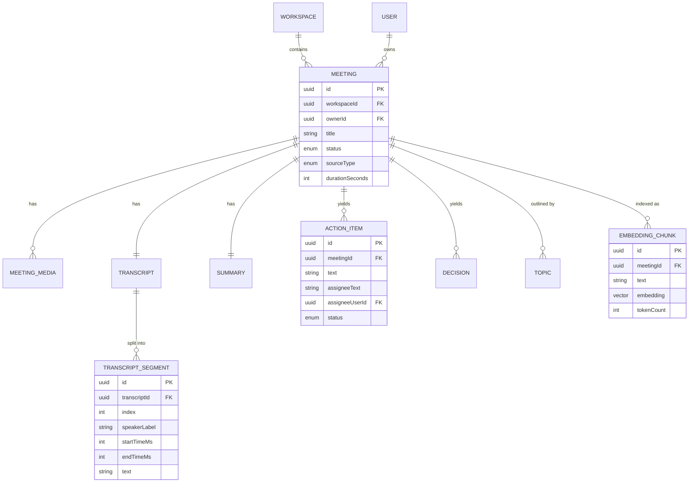
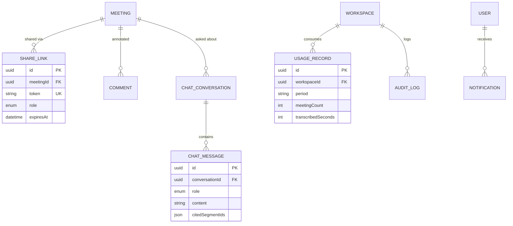

# Database Design

| Field     | Value                              |
|-----------|------------------------------------|
| Version   | 1.0                                |
| Status    | Phase 5 — Draft, pending approval  |
| Date      | 2026-07-22                         |
| Depends on| PRD.md, architecture.md, tech-stack.md |
| Phase     | 5 of 18 — Database Design          |
| Schema    | [`apps/api/prisma/schema.prisma`](../apps/api/prisma/schema.prisma) |

This document explains the **design**. The exact column/type definitions live in the Prisma
schema — this doc covers the *why*: principles, normalization, ER diagrams, index and constraint
strategy, the pgvector setup, migration plan, and seed data.

---

## 1. Design Principles

1. **Multi-tenant by `workspaceId`.** Every tenant-scoped table carries `workspace_id`, indexed,
   and every repository query is scoped to a workspace. Isolation is enforced in the application
   layer (with tests), not left to convention. *(Postgres Row-Level Security is a future option
   for defense-in-depth; we don't need it at v1 scale.)*
2. **UUID primary keys.** Opaque, non-enumerable (can't guess `?id=2`), and safe to generate
   client-side or across services. Trade-off: larger index footprint than bigint — acceptable.
3. **Audit columns everywhere.** `createdAt`, `updatedAt` on every mutable table; `deletedAt`
   for soft-deletable aggregates (User, Workspace, Meeting). Soft deletes preserve referential
   integrity and audit history; a Prisma client extension filters them out of normal queries.
4. **Snake_case tables, PascalCase models.** Prisma model `Meeting` maps (`@@map`) to the
   `meetings` table — Postgres-native naming, clean TS naming.
5. **Enums for bounded value sets** (PlanTier, MeetingStatus, roles…). Stored as native Postgres
   enums — type-safe, compact, validated at the DB.
6. **Money/sensitive fields absent.** We never store card data (Stripe holds it); we store only
   Stripe identifiers.
7. **Bigint for byte sizes** (`sizeBytes`) to avoid 32-bit overflow on large media files.

---

## 2. Normalization (and where we deliberately break it)

**1NF — atomic values, no repeating groups.** The transcript is stored as many
`TranscriptSegment` rows, not a giant text blob or array. This is what makes timestamp-level
search, citation, and per-segment embeddings possible.

**2NF — no partial-key dependencies.** Relevant on our composite-keyed junctions (e.g.
`WorkspaceMember` keyed by `(userId, workspaceId)`): every non-key column depends on the *whole*
key. `UsageRecord` keyed by `(workspaceId, period)` — counts depend on the workspace-month pair,
nothing narrower.

**3NF — non-key columns depend only on the key, not on other non-key columns.** `plan` lives on
`Workspace` (depends on the workspace), not duplicated onto every `Meeting`. Denormalization is
deliberate and documented when it happens.

**Deliberate denormalizations (justified 3NF trade-offs):**
- **`EmbeddingChunk.meetingId`** — denormalized from the transcript chain so vector searches can
  filter by `meeting_id` (and `workspace_id` via join) **without** chasing `chunk → segment →
  transcript → meeting`. Faster filtered ANN search, at the cost of redundant storage. Worth it.
- **`Json` columns** (`Summary.keyPoints`, `ChatMessage.citedSegmentIds`, `Notification.payload`,
  `AuditLog.metadata`) — used for flexible, semi-structured data that has no queryable relational
  need. This is a pragmatic 3NF relaxation: normalizing these into child tables would add joins
  for no business value. (We add GIN indexes where we *do* query into JSON.)

> **Lesson:** normalization is a tool for integrity and avoiding anomalies, not a religion. The
> right question is always "does denormalizing here create an update anomaly?" If not, and it buys
> meaningful performance or flexibility, denormalize with a comment.

---

## 3. ER Diagrams

### 3.1 Tenancy & Identity



### 3.2 Meetings & AI Content



### 3.3 Collaboration, Chat, Usage, Audit



---

## 4. Table Catalog (grouped by domain)

| Domain | Tables |
|--------|--------|
| **Tenancy / Identity** | `users`, `workspaces`, `workspace_members`, `invitations`, `oauth_accounts` |
| **Meetings & content** | `meetings`, `meeting_media`, `transcripts`, `transcript_segments`, `summaries`, `action_items`, `decisions`, `topics`, `embedding_chunks` |
| **Collaboration / AI** | `share_links`, `comments`, `chat_conversations`, `chat_messages` |
| **Billing / ops** | `subscriptions`, `usage_records`, `notifications`, `audit_logs` |

Every relationship is documented in the schema via Prisma relations (1:1, 1:N). There are no
many-to-many tables beyond `workspace_members` — the domain is naturally hierarchical
(Workspace → Meeting → Transcript → Segments / Chunks).

---

## 5. Index Strategy

| Index type | Where | Why |
|-----------|-------|-----|
| **B-tree (default)** | every `workspace_id`, `meeting_id`, `user_id` FK | tenant-scoped and parent-scoped lookups are the hottest path |
| **Composite** | `(workspaceId, status)` on meetings, `(userId, readAt)` on notifications | power the most common filtered list queries |
| **Unique** | `email`, `slug`, `(workspaceId, period)`, `(userId, workspaceId)`, `token`s | enforce business invariants at the DB |
| **GIN (pg_trgm)** | `transcript_segments.text`, `meetings.title` | fast **full-text / fuzzy** keyword search |
| **GIN (jsonb)** | jsonb columns queried into (where needed) | query into `payload`/`metadata` when product demands |
| **HNSW (vector)** | `embedding_chunks.embedding` | approximate-nearest-neighbor for **semantic search** |
| **tsvector (generated col + GIN)** | `transcript_segments` | keyword ranking for **hybrid** search (BM25-style) |

> **Hybrid search:** we combine vector similarity (semantic) with full-text ranking (keyword) and
> merge results — this beats either alone. That's why both an HNSW index *and* a tsvector/GIN
> index exist on the transcript data.

---

## 6. pgvector & Vector Setup

The `embedding_chunks.embedding` column uses Prisma's `Unsupported("vector(384)")` type. Prisma
does not (yet) manage vector DDL or similarity operators, so these are applied in a **raw SQL
migration**:

```sql
-- 1. Ensure the extension (also declared in schema datasource)
CREATE EXTENSION IF NOT EXISTS vector;

-- 2. ANN index for fast similarity search (cosine distance)
CREATE INDEX embedding_chunks_embedding_idx
  ON embedding_chunks
  USING hnsw (embedding vector_cosine_ops)
  WITH (m = 16, ef_construction = 64);

-- 3. Example similarity query (used by the Search/Chat modules)
SELECT id, text, meeting_id,
       1 - (embedding <=> $1) AS score          -- $1 = query vector
FROM embedding_chunks
WHERE meeting_id = ANY($2)                       -- workspace-scoped
ORDER BY embedding <=> $1
LIMIT 20;
```

`384` matches our chosen self-hosted embedding model (`BAAI/bge-small-en-v1.5`). Changing the
model means a dimension migration + re-embedding — handled by the migration strategy below.

---

## 7. Full-Text Search Setup

```sql
-- Generated tsvector column (auto-maintained from text)
ALTER TABLE transcript_segments
  ADD COLUMN search_vector tsvector
  GENERATED ALWAYS AS (to_tsvector('english', text)) STORED;

CREATE INDEX transcript_segments_search_idx
  ON transcript_segments USING GIN (search_vector);
```

This powers keyword search and the keyword half of hybrid search.

---

## 8. Constraints Strategy

- **NOT NULL** on all required fields; nullable only where genuinely optional.
- **UNIQUE** constraints encode business rules: one email, one slug, one active membership per
  (user, workspace), one usage row per (workspace, period).
- **CHECK constraints** (added in raw SQL where Prisma can't express them): e.g.
  `duration_seconds >= 0`, `confidence BETWEEN 0 AND 1`, `period` matches `^\d{4}-\d{2}$`.
- **Foreign keys with explicit delete behavior:** `ON DELETE CASCADE` for owned children
  (deleting a Meeting removes its segments/embeddings/summary); `SET NULL` for soft references
  (e.g. audit log user); `RESTRICT` where deletion should be blocked (e.g. can't delete the last
  Owner of a Workspace — enforced in app logic).

---

## 9. Migration Strategy

We use **Prisma Migrate** for schema changes and **raw SQL migrations** for what Prisma can't
express (extensions, vector indexes, tsvector, CHECKs).

**Workflow:**
- **Local dev:** `prisma migrate dev --name <desc>` — generates a timestamped SQL migration and
  applies it. Review the generated SQL before committing.
- **Production:** `prisma migrate deploy` — applies pending migrations in order, non-interactively
  (safe for CI/CD).
- **Custom SQL:** create `migrations/<ts>_<name>/migration.sql` by hand for vector/FTS/CHECKs;
  Prisma runs them like any migration.

**Zero-downtime principles (for prod schema changes):**
1. **Expand → migrate → contract.** Add the new column/table first (expand), backfill data, switch
   reads/writes, then remove the old one in a later deploy (contract). Never do a breaking change
   and a code change in one step.
2. **Avoid locking writes on large tables.** Add columns `NULL`-able + backfill, create indexes
   `CONCURRENTLY` (raw SQL), batch large updates.
3. **Backwards-compatible migrations only** between releases; destructive changes wait a release.

**Re-embedding pipeline (model change):** version the embedding model in a config table or env;
when it changes, enqueue a backfill job that re-embeds all chunks, swap reads to the new column,
then drop the old.

---

## 10. Seed Data

A reproducible seed (`prisma db seed`, implemented in Phase 9) for local dev, demos, and tests:

- **1 Workspace** ("Acme Inc", plan `BUSINESS`).
- **3 Users** — Owner (`owner@acme.test`), Admin, Member — with known passwords for login.
- **3 WorkspaceMembers** wiring the roles.
- **2 Meetings** — one fully processed (`READY`) with transcript segments, summary, 3 action items,
  1 decision, topics, and ~10 embedding chunks; one stuck in `QUEUED` to exercise the UI states.
- **1 Subscription** (Stripe test customer id), **1 UsageRecord** for the current period.
- **1 ChatConversation** with a sample Q&A turn (to seed the chat UI).

Passwords are hashed with the real bcrypt cost used in production; emails are clearly fake
(`*.test`) so seed data can never leak into real flows. Seed is idempotent (`upsert`) so it can
be re-run safely.

---

## 11. Open Questions (before Phase 6)

1. **Soft-delete scope** — confirm we soft-delete Users/Workspaces/Meetings (recommended) vs.
   hard delete. Affects retention/GDPR export logic.
2. **Embedding dimension** — confirm 384 (bge-small). A larger model (1024-dim) raises accuracy
   but storage/latency; we'd change the column + index.
3. **Audit logging breadth** — include `audit_logs` from day one (recommended for B2B) or defer?

---

*End of Phase 5 deliverable. Approval required before Phase 6 (API Design).*
