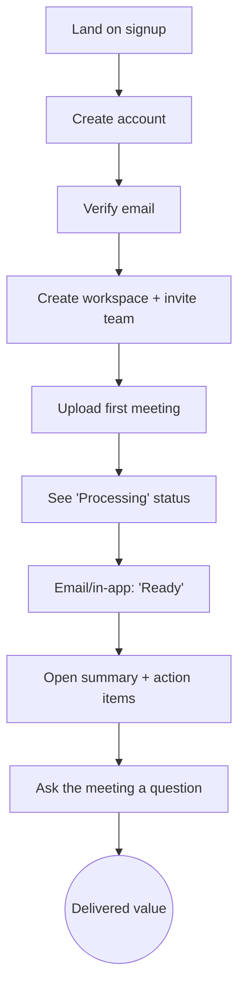

# UI/UX Planning

| Field     | Value                              |
|-----------|------------------------------------|
| Version   | 1.0                                |
| Status    | Phase 7 — Draft, pending approval  |
| Date      | 2026-07-22                         |
| Depends on| PRD.md, api.md                     |
| Phase     | 7 of 18 — UI/UX Planning           |

Wireframes are text/ASCII (they become shadcn/ui components in Phase 8). This doc covers UX
principles, information architecture, user flows, screen wireframes, interaction details, state
design, responsive behavior, dark mode, and accessibility.

---

## 1. UX Principles

1. **Clarity over cleverness.** Every screen answers "what is this and what can I do here?"
2. **Feedback for every action.** Uploads, processing, chat — all show progress or state. Never a
   silent spinner with no context.
3. **Consistency.** Same component = same behavior everywhere (design tokens + shadcn/ui).
4. **Efficiency for power users.** Keyboard shortcuts, `⌘K` command palette, `/` to search.
5. **Graceful degradation.** Empty/loading/error states are first-class, not afterthoughts.
6. **Accessible by default.** WCAG 2.1 AA is a baseline, not a phase.

---

## 2. Design System (tokens)

We use **semantic design tokens** (CSS variables) consumed by Tailwind + shadcn/ui. Tokens carry
*meaning*, not raw colors — so theming (dark mode, future branding) changes values, not usages.

| Token group | Examples | Purpose |
|-------------|----------|---------|
| **Surface** | `background`, `foreground`, `card`, `muted` | page/panel backgrounds & text |
| **Brand** | `primary`, `primary-foreground` | actions, links, focus |
| **Feedback** | `destructive`, `success`, `warning` | errors, success, quota warnings |
| **Border/ring** | `border`, `ring`, `input` | outlines, focus rings |
| **Radius/spacing** | `--radius`, 4px base grid | consistent shape & rhythm |
| **Type scale** | `text-sm…text-3xl`, line-height | hierarchy |

Each token has a light and dark value; switching themes swaps the values only.

---

## 3. Information Architecture & Navigation

```
Top bar:  Logo · ⌘K Search · Notifications · Workspace switcher · Avatar
Sidebar:  Dashboard · Search · Library(1) · — · Settings
Tabs (meeting detail): Summary · Transcript · Action Items · Decisions · Chat
```
_(1) Library = saved/filtered views — roadmap._

- **Workspace switcher** in the top bar (multi-workspace users) + sidebar context.
- **Command palette (`⌘K`)**: jump to meetings, run actions (upload, search), switch workspace.
- **Responsive collapse:** sidebar → drawer (tablet) → bottom tab bar (mobile).

---

## 4. User Flows

### 4.1 Primary "aha" flow — new user to first summary


This flow is the *product-market-fit test* (PRD KR1). It must be frictionless: minimal fields,
clear progress, a notification when ready, and an immediately useful summary.

### 4.2 Returning user — search & chat
`Dashboard → ⌘K / → type query → Results → open meeting → Chat tab → ask → cited answer`

### 4.3 Share meeting
`Meeting → Share → choose role/expiry → copy link → recipient opens public view (read-only, scoped)`

### 4.4 Upgrade (quota hit)
`Upload → 402/quota modal → Plans → Stripe Checkout → return → upload succeeds`

---

## 5. Wireframes

### 5.1 Dashboard (desktop)

```
┌──────────────────────────────────────────────────────────────┐
│ ◼  ⌘K Search…                              🔔   Acme ▾   AB ▾ │
├────────────┬─────────────────────────────────────────────────┤
│ ◉Dashboard │  Meetings                    [ Filter ▾ ]  [↑]  │
│  🔍Search  │  ┌───────────────────────────────────────────┐  │
│  📚Library │  │  +  Upload meeting                        │  │
│            │  │     Drag & drop audio/video, or browse    │  │
│            │  └───────────────────────────────────────────┘  │
│            │  5 / 50 meetings this month · 300/2000 min     │
│            │                                                  │
│            │  ┌───────────────────────────────────────────┐  │
│            │  │ ● Q3 Planning Sync        READY · 42m      │  │
│            │  │   3 actions · 2 decisions · Jul 21         │  │
│            │  ├───────────────────────────────────────────┤  │
│            │  │ ◐ Sales Call – Globex   SUMMARIZING · 28m  │  │
│            │  ├───────────────────────────────────────────┤  │
│            │  │ ○ Standup               QUEUED · 15m       │  │
│            │  └───────────────────────────────────────────┘  │
│ ⚙ Settings │  Load more                                       │
└────────────┴─────────────────────────────────────────────────┘
```
Status icons (● ready / ◐ processing / ○ queued) give an instant visual scan.

### 5.2 Upload (modal)

```
        ┌─ Upload meeting ──────────────────────┐
        │                                    ✕  │
        │   ┌──────────────────────────────┐    │
        │   │      ⬆  Drop file here        │    │
        │   │   or click to browse          │    │
        │   │   mp3 · wav · mp4 · up to 2GB │    │
        │   └──────────────────────────────┘    │
        │   Title  [ Q3 Planning Sync         ] │
        │   Date   [ 2026-07-21               ] │
        │   ⚠ 3 of 5 meetings used this month   │
        │            [ Cancel ]   [ Process ▶ ] │
        └───────────────────────────────────────┘
```

### 5.3 Meeting detail — Summary tab

```
┌──────────────────────────────────────────────────────────────┐
│ ← Back   Q3 Planning Sync                  Share  ⋯ More     │
├──────────────────────────────────────────────────────────────┤
│ [Summary]  Transcript  Action Items  Decisions  Chat        │
├───────────────────────────────┬──────────────────────────────┤
│ Overview                      │ ▶ ──●────────── 42:13/1:02   │
│ The team aligned on shipping  │ Speaker: Dana                 │
│ a usage-based tier by Aug 15. │ ───────────────────────────── │
│                               │ "…we'll ship the pricing      │
│ Key Points                    │  tier before the launch…"     │
│ • Shift to usage-based pricing│                                │
│ • Launch by Aug 15            │ (click any line to seek audio)│
│                               │                                │
│ Action Items (3)   [ open ▾ ] │                                │
│ ☐ Marcus — draft pricing      │                                │
│ ☐ Dana — update roadmap       │                                │
│                               │                                │
│ Decisions (2)                 │                                │
│ ✓ Freeze scope for v1         │                                │
└───────────────────────────────┴──────────────────────────────┘
```

### 5.4 Meeting detail — Transcript tab

```
┌──────────────────────────────────────────────────────────────┐
│ Summary  [Transcript]  Action Items  Decisions  Chat         │
├──────────────────────────────────────────────────────────────┤
│ ▶ ────────────●────────  42:13 / 1:02:30     [1x]  [⤓]      │
├──────────────────────────────────────────────────────────────┤
│ 00:00  Speaker 1  Thanks everyone for joining…               │
│ 00:24  Dana       Let's start with the pricing decision.     │
│ 01:10  Marcus    I think usage-based makes sense…    ✏ 💬   │
│        ▸ matched: "pricing"  (search highlight)              │
│ 02:45  Dana       We'll ship before Aug 15.           ✏ 💬   │
└──────────────────────────────────────────────────────────────┘
```

### 5.5 Meeting detail — Chat tab (RAG)

```
┌──────────────────────────────────────────────┐
│ Ask about "Q3 Planning Sync"             ✕   │
├──────────────────────────────────────────────┤
│ You: What did we decide about pricing?       │
│                                              │
│ 🤖 We decided to shift to **usage-based      │
│    pricing**, launching Aug 15 [▸seg 12].    │
│    Marcus will draft the tiers [▸seg 18].    │
│                                              │
│ Suggested:  What are the action items?       │
│            Who owes what?                    │
├──────────────────────────────────────────────┤
│ [ Ask a question…                 ] [ ↑ ]    │
└──────────────────────────────────────────────┘
```
Citations (`[▸seg 12]`) are clickable → jump to that transcript line + seek audio.

### 5.6 Search

```
┌──────────────────────────────────────────────────────────────┐
│ 🔍 pricing objections                         [ hybrid ▾ ]    │
│ 12 results across 4 meetings                                 │
├──────────────────────────────────────────────────────────────┤
│ Q3 Planning Sync · Jul 21 · 98% match                        │
│ "…Marcus raised concerns about the enterprise tier…"      ▸  │
│ ──────────────────────────────────────────────────────────── │
│ Sales Call – Globex · Jul 19 · 91% match                     │
│ "…pushback on per-seat pricing from the buyer…"           ▸  │
└──────────────────────────────────────────────────────────────┘
```

### 5.7 Settings — Members (desktop)

```
┌────────────┬─────────────────────────────────────────────────┐
│ Settings   │  Members                        [ + Invite ]    │
│  Profile   │  ┌───────────────────────────────────────────┐  │
│  Workspace │  │ AB  Dana (You)     Owner          —       │  │
│ ◉ Members  │  │ MR  Marcus         Admin     [ role ▾ ]    │  │
│  Billing   │  │ SP  Priya          Member    [ role ▾ ]    │  │
│  Security  │  └───────────────────────────────────────────┘  │
│            │  Pending invites: sam@acme.test (Member)        │
└────────────┴─────────────────────────────────────────────────┘
```

### 5.8 Public share view
Same as Meeting detail but **read-only**, scoped to the link's role (Viewer = no comments;
Commenter = can comment). Prominent "You're viewing a shared meeting" banner; no workspace nav.

---

## 6. Interaction Details

| Interaction | Behavior |
|-------------|----------|
| **Audio-synced transcript** | Clicking any transcript line seeks the player to that timestamp; current line highlights + auto-scrolls during playback. |
| **Citation click** | In chat, clicking `[▸seg N]` scrolls transcript to the line and seeks audio. |
| **Command palette `⌘K`** | Quick nav + actions; fuzzy search across meetings. |
| **`/` focuses search** | Vim-style; common in productivity apps. |
| **Drag-and-drop upload** | Drop anywhere on the dashboard → opens upload modal pre-filled. |
| **Copy-on-hover** | Hover a transcript line → copy button appears. |
| **Toasts** | Success/error feedback (non-blocking); errors also offer a retry action. |

---

## 7. State Design

Every list/action has all three states designed:

- **Empty:** "No meetings yet — upload your first" with a CTA (never a blank page).
- **Loading:** **Skeletons** that match final layout (not generic spinners) — reduces perceived
  layout shift. Processing meetings show a progress chip + ETA where possible.
- **Error:** friendly message + retry; never raw stack traces. Offline → "Reconnecting" banner.
- **Success:** toast + optimistic UI update (e.g., action item toggles instantly, reconciles on
  server confirmation).

---

## 8. Responsive Layout

Tailwind mobile-first breakpoints: `sm 640 · md 768 · lg 1024 · xl 1280`.

| Device | Layout |
|--------|--------|
| **Mobile** (<768) | Bottom tab bar (Dashboard/Search/Settings); top bar with hamburger; single-column; upload via native file picker; chat full-screen. |
| **Tablet** (768–1024) | Collapsible sidebar (drawer on tap); meeting detail keeps side-by-side at lg+. |
| **Desktop** (≥1024) | Persistent sidebar; meeting detail two-pane (content + player/transcript). |

Key rules: target sizes ≥ 44×44px (touch); no hover-only affordances (always a tap target);
tables collapse to cards on mobile.

---

## 9. Dark Mode

- **Token-driven** (§2): `data-theme="dark"` swaps token values; components use tokens, never
  hard-coded colors.
- **Detection:** respect `prefers-color-scheme` on first visit; user toggle in settings,
  persisted (localStorage); three modes — light / dark / system.
- **Contrast:** both themes meet WCAG AA 4.5:1 (verified in tests via axe).
- **No flash:** inline script sets the theme before paint (FOUC prevention).

---

## 10. Accessibility (WCAG 2.1 AA)

| Area | Standard |
|------|----------|
| **Semantic HTML** | Landmarks (`header/nav/main/aside`), headings in order, lists for lists. |
| **Keyboard** | Full keyboard operability; logical tab order; visible focus ring (`:focus-visible`); skip-to-content link. |
| **ARIA** | Only where HTML is insufficient (live regions for chat streaming, `aria-busy` on loading). Radix primitives handle most of this. |
| **Contrast** | ≥ 4.5:1 text, ≥ 3:1 UI components/graphics, in both themes. |
| **Forms** | Labels associated (`htmlFor`/`id`); errors announced (`aria-describedby` + `role="alert"`). |
| **Media** | Transcript is the accessible alternative to audio; player has accessible controls. |
| **Motion** | Respect `prefers-reduced-motion` (disable non-essential animation). |
| **Screen readers** | Hidden content via `aria-hidden`; icons have `aria-label` or paired text; status chips have text (not color-only). |
| **Testing** | `jest-axe` on components + `@axe-core/playwright` in E2E — CI fails on violations. |

> *Why accessibility is a Phase-7 concern, not Phase-11:* retrofitting a11y is expensive and
> error-prone. Designing for it now (semantics, contrast, focus) means Phase-8 components are born
> accessible — Radix + shadcn give us a huge head start.

---

## 11. Open Questions (before Phase 8)

1. **Brand:** any name/logo/color preference, or proceed with a neutral palette to be themed later?
2. **Command palette `⌘K`:** include in v1 (recommended — big usability win) or defer?
3. **Mobile:** responsive web only for v1 (recommended), or plan a native app early?

---

*End of Phase 7 deliverable. Approval required before Phase 8 (Frontend Development).*
